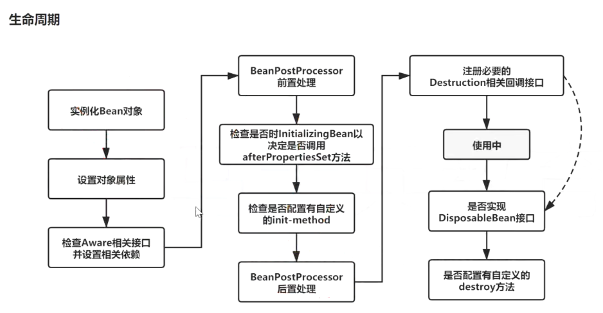
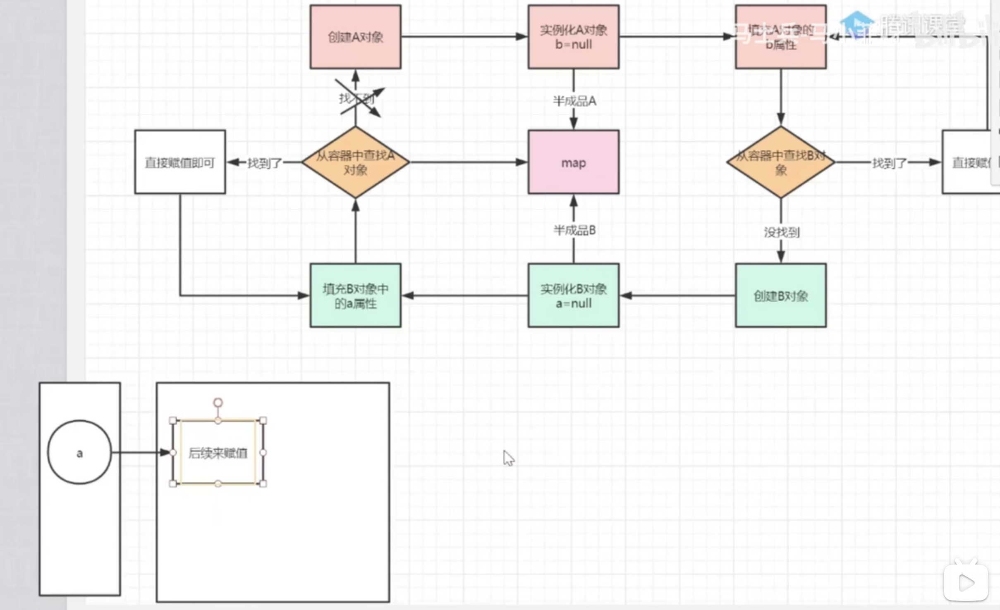
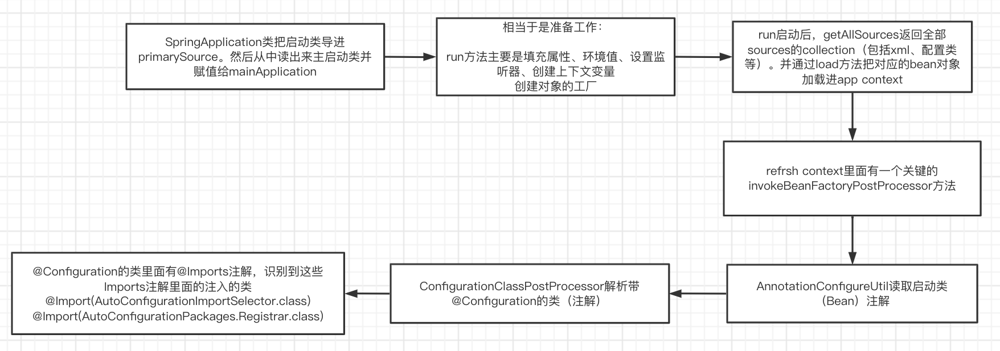

# Spring面试问题答题思路（初级校招版）

总分结构

总：先对问题做一个简要的概括

分：分点来描述细节，不清楚的点可以选择性略过

突出技术名词，核心概念（**核心概念、接口、类、关键方法**）

## 1、谈谈IOC的理解，原理和实现

Inverse Of Control：理论思想，原来的对象是由使用者来进行控制，有了spring之后，可以把整个对象交给spring来帮我们进行管理

DI：@Autowired populateBean，把对应属性注入到具体的Bean中去

容器：存储对象，使用map结构来存储，在spring中一般存在三级缓存，singletonObjeacts存放完整的bean对象，整个bean的生命周期，从创建到使用到销毁的过程全部都是由容器来管理的(bean的生命周期)

**分**：

1.一般聊ioc容器的时候涉及到容器的创建过程(beanFactory,DefaultListableBeanFactory),想bean工厂中设置一些参数(BeanPostProcessor,Aeare接口的子类)等等属性

2.加载解析bean对象，准备要创建的bean对象的定义对象beanDefinition(xml或者注解的解析过程)

3.beanFactoryPostProcessor的处理，此处是扩展点，PlaceHolderConfigurSupport，ConfigurationClassPostProcessor

4.BeanPostProcessor的注册功能，方便后续对bean对象完成具体的扩展功能

5.通过反射的方式讲BeanDefinition对象实例化成具体的bean对象

6.bean对象的初始化过程(填充属性，调用aware子类的方法，调用BeanPostProcessor前置处理方法，调用init-mehtod方法，BeanPostProcessor的后置处理方法)

7.生成完整的bean对象，通过getBean方法可以直接获取

8.销毁过程

​	具体的细节就不清楚了，但是spring中的bean都是通过反射的方式生成的，同时其中包含了很多的扩展点(对占位符的处理)，比如最常用的对BeanFactory的扩展，对bean的扩展，我们在公司对这方面的使用是比较多的，除此之外，ioc中最核心的也就是填充具体bean的属性，和生命周期(背一下)。

## **2、IOC的底层实现**

对IOC的理解，和实现流程

反射、工厂、设计模式、关键的几个方法名

带do的是实际执行逻辑的方法，不带do的都是在包在外层的facet

createBeanFactory , getBean ,doGetBean , createBean , doCreateBean,createBeanInstance(getDeclaredConstructor(),newinstance),populateBean

- 1.先通过createBeanFactory 创建一个Bean工厂(DefaultListableBeanFactory)

- 2.开始循环创建对象，因为容器中的bean默认都是单例的，所以优先通过getBean，doGetBean从容器中查找，找不到的话，

- 3.通过createBean，doCreateBean方法，以反射的方式创建对象，一般情况下使用的是无参的构造器(getDeclaredConstructor(),newinstance)

- 4.进行对象的属性填充populateBean

- 5.进行其他的初始化操作(initializingBean)

## **3、描述Bean的生命周期**

在表述的时候不要只说图片中有的关键点，要学会扩展描述

设置对象这步骤 可以衍生出循环依赖的问题

- 1.实例化Bean，反射的方式生成对象

- 2.填充bena的属性：populateBean(),循环依赖的问题(三级缓存)

- 3.调用aware接口相关的方法：invokeAwareMethod(完成BeanName可以获取容器bean的名称，BeanFactory获取当前bean factory这也可以调用容器的服务，BeanClassLoader对象的属性设置)

- 4.调用BeanPostProcessor中的前置处理方法：使用比较多的有(ApplicationContextPostProcessor设置ApplicationContext，Environment,ResourceLoader,EmbeddValueResolver等对象)

- 5.调用initmethod方法:invokeInitmethod(),判断是否实现了InitializingBean接口，如果有，调用afterPropertiesSet方法，

- 6.调用BeanPostProcessor的后置处理方法：spring的aop就是在此处实现的，AbstractAutoProxyCreator

​		注册Destuction相关的回调接口

- 7.获取到完整的对象，可以通过getBean的方式来进行对象的获取

- 8.销毁流程 ①判断是否实现了DispoableBean接口②调用destroyMethod方法

## **4、对AOP底层实现的理解**

总得来说，AOP就是一种功能增强机制，官方名字叫面向切面编程，功能是在不改变原有代码的逻辑基础上为原方法新增一些业务逻辑。AOP是通过动态代理的方式来进行增强的。AOP实际上就是基于IOC的特性做的一些扩展。

- 它有三种增强方式，前后和环绕，分别对应在方法执行流程不同环节上进行增强。其中两个概念，切面和切点，分表代表着某个逻辑要加在哪个方法上面。
- 它通过动态代理来实现增强，有jdk和cglib两种方式。cglib的执行逻辑是
  - 在执行方法调用的时候，会调用到生成的字节码文件中，直接回找到DynamicAdvisoredInterceptor类中的intercept方法，从此方法开始执行
  - 根据之前定义好的通知来生成拦截器
  - 从拦截器链中依次获取每一个通知开始进行执行，在执行过程中，为了方便找到下一个通知是哪个，会有一个CglibMethodInvocation的对象，找的时候是从-1的位置依次开始查找并且执行的
- 它和IoC的关系，AOP是基于IoC的特性实现的。IoC在设计的时候为高可扩展性做了铺垫，在Bean生命周期的BeanPostProcessor方法中能够为Bean对象增加增强功能。
- 应用场景，比如缓存和日志，这类高频但是会涉及很多重复代码的场景就适合用AOP来做

## **5、循环依赖的发生与解决**

循环依赖就是由于两个Bean对象还没有生成的时候或者在生命周期还没有完成初始化的过程中，二者彼此都有了依赖，导致初始化赋值无法继续下去，因为依赖的对方还没有初始化完成，也即在内存空间中还没有分配地址（也就没有引用）。

解决的话就是三级缓存（三个map）用来存放处于不同阶段的Bean（成品与半成品的区别，有没有填充属性的区别）。需要引入其他Bean的时候先去缓存而非全局Bean容器中找，找到之后引用其代理，后续再对这个半成品的对象进行属性的填充。

一级缓存：完整Bean对象

二级缓存：还没有填充属性的半成品

三级缓存：三级缓存的value类型是ObjectFactory，是一个函数式接口，存在的意义是保证在整个容器的运行过程中同名的bean对象只能有一个

普通对象和代理对象是不能同时出现在容器中的，因此当一个对象需要被代理的时候，就要使用代理对象覆盖掉之前的普通对象，在实际的调用过程中，是没有办法确定什么时候对象被使用，所以就要求某个对象被调用的时候，优先判断此对象是否需要被代理，类似于一种回调机制的实现，因此传入lambda表达式的时候，可以通过lambda表达式来执行对象的覆盖过程，getEarlyBeanReference()

因此，所有的bean对象在创建的时候要优先放到三级缓存中，在后续的使用过程中，如果需要被代理则返回代理对象，如果不需要被代理，则直接返回普通对象

各级缓存放置的时间：

三级缓存：createBeanInstance之后：addSingletonFactory

二级缓存：第一次从三级缓存确定对象是代理对象还是不同对象的时候，同时删除三级缓存getSingleton

一级缓存：生成完整对象之后放到一级缓存，删除二三级缓存：addSingleton

## **6、BeanFactory和FactoryBean的区别**

相同点：都是用来创建Bean对象的

不同点：使用BeanFactory创建对象的时候，必须要遵循严格的生命周期流程，太复杂了，如果想要简单的自定义某个对象的创建，同时创建完成的对象想交给spring来管理，那么就需要实现FactoryBean接口的方法

总结就是，如果需要按照标准化来批量生产，则用BeanFactory，见名知意；如果要个性化定义则用FactoryBean

## **7、Spring中用到的设计模式**

参考《图解设计模式》过一下Spring中的几个重点设计模式

<u>单例模式</u>：bean默认都是单例的

原型模式：指定作用域为prototype

<u>工厂模式</u>：BeanFactory

模板模式：postProcessBeanFactory，onRefresh，initPropertyValue

策略模式：XmlBeanDefinitionReader，PropertiesBeanDefinitionReader

观察者模式：listener，event，multicast

<u>适配器模式</u>：Adapter - SecurityConfigurerAdapter

装饰者模式：BeanWrapper

责任链模式：使用aop的时候会生成一个拦截器链

<u>代理模式</u>：动态代理

委托者模式：delegate

## **8、Spring事务是如何实现回滚的**

总：spring的事务是由aop来实现的，首先要生成具体的代理对象，然后按照aop的整套流程来执行具体的操作逻辑，正常情况下要通过通知来完成核心功能，但是事务不是通过通知实现的，而是通过一个TransactionInterceptor来实现的，然后调用invoke来实现具体的逻辑

分：1.先做准备工作，解析各个方法上事务相关的属性，根据具体的属性来判断是否开始新事务

​		2.当需要开启的时候，获取数据库连接，关闭自动提交功能，开启事务

​		3.执行具体的sql逻辑操作

​		4.在操作过程中，如果执行失败了，那么会通过completeTransactionAfterThrowing看来完成事务的回滚操作，回滚的具体逻辑是通过doRollBack方法来实现的，实现的时候也是要先获取链接对象，通过连接对象来回滚。

​		5.如果执行过程中，没有任何意外情况的发生，那么通过commitTransactionAfterReturning来完成事务的提交操作，提交的具体逻辑是通过doCommit方法来实现的，实现的时候也要获取链接，通过链接对象来提交

​		6.当事务执行完毕之后需要清除相关的事务信息cleanupTransactionInfo

如果想要聊的更加细致的话，需要知道TransactionInfo，TransactionsStatus

## **9、Spring事务传播**

传播特性有几种？七种

Required，Requireds_new,nested,Support,Not_Support,Never,Mandatory

某一个事务嵌套另外一个事务的时候怎么办？

A方法调用B方法，AB方法都有事务，并且传播特性不同，那么A如果有异常，B怎么办，B如果有异常，A怎么办？

**总**：事务的传播特性指的是不同方法的嵌套调用过程中，事务该如何进行处理，是同一个事务还是不同的事务，当出现异常的时候会回滚还是提交，两个方法之间相互影响，在日常工作中，使用比较多的是required，Requireds_new

**分**：1.先说事务的不同分类，可以分为三类，支持当前事务，不支持当前事务，嵌套事务

​		2.如果外层方法是required，内层方法是：required，requireds_new,nested

​		3.如果外层方法是requireds_new，内层方法是：required，requireds_new,nested

​		4.如果外层方法是nested，内层方法是：required，requireds_new,nested

核心处理逻辑非常简单：

1.判断内外方法是否是同一事务：

​		是：异常统一在外层方法处理

​		不是：内层方法有可能影响到外层方法，但是外层方法是不会影响内层方法的

​		（大致可以这么理解，但是有个别情况不同，nested）

## 10、SpringBoot自动装配原理

简单讲就是SpringBootApplication注解当中核心组成部分@EnableAutoConfiguration里面导入了两个东西，一是@Import(AutoConfigurationPackages.Registrar.class，该包导入了导包规则；其次是@Import(AutoConfigurationImportSelector.class)，这个包则是指定从从META-INF/spring.factories中按照Registrar的规则来讲依赖包进行导入。

如何识别到这些Imports见下图

上面这两部分加起来才算对自动装配的原理有了一个较为深入的理解

